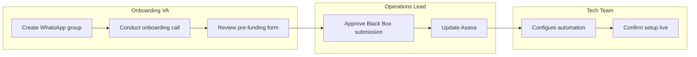
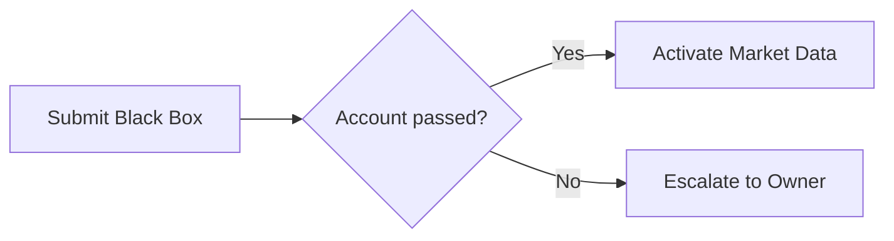

# Framework: Swim-Lane Format

How and when to use swim-lane diagrams inside an SOP. Swim-lanes show *who* does *what* and *in what order* when multiple actors are involved.

Load this framework when the process has 2+ actors handing work off to each other.

---

## When to Use a Swim-Lane

Add a swim-lane diagram to the SOP (right after the Overview, before Steps) when:

- Three or more roles touch the process
- The order of actions matters AND the actors change between steps
- The user has historically lost track of "where is this now?"

If the process is linear and single-actor, skip — adds clutter.

---

## Swim-Lane Format (Mermaid)

Markdown-renders cleanly in GitHub, Obsidian, and most note apps. Use this format by default:

```markdown
### 🏊 Swim-Lane


```

Each `subgraph` block is one actor's lane. Boxes inside are the steps that actor performs. Arrows show the handoff order.

---

## Format Conventions

- **Lane name = role title.** Not a person's name. "Onboarding VA", not "Sarah".
- **Step labels match SOP step titles.** "Create WhatsApp group" in the diagram = "STEP 1 — Create Client WhatsApp Group" in the SOP body.
- **Left-to-right by default.** `flowchart LR`. Top-to-bottom (`TD`) only if the process has many parallel branches.
- **Handoffs cross lanes.** When the arrow leaves one lane and enters another, that is a handoff — call it out in the corresponding SOP step as "Handoff to <role>."

---

## When to Use Decision Diamonds

If a step has a real branch (pass / fail, approved / rejected), use a Mermaid decision node:



Limit decision diamonds to actual binary decisions. "Maybe-paths" are not decisions, they are exceptions — put those in the SOP step body as sub-bullets.

---

## Anti-Patterns

| Anti-Pattern | Fix |
|---|---|
| Diagram for a single-actor process | Remove it — it has nothing to show |
| Lane labels = person names | Replace with role titles |
| Step labels don't match SOP step titles | Resync — readers should be able to map 1:1 |
| Decision diamonds with 4+ outgoing arrows | Not a decision, that's a routing table — extract to a separate matrix |
| Diagram drifts as steps get added | Update the diagram in the same commit that changes steps |

---

## Fallback: ASCII Swim-Lane

If Mermaid is not supported by the destination (some legacy doc systems), fall back to a markdown table:

```markdown
| Onboarding VA | Operations Lead | Tech Team |
|---|---|---|
| 1. Create WhatsApp group | | |
| 2. Conduct onboarding call | | |
| 3. Review pre-funding form | | |
| | 4. Approve Black Box | |
| | 5. Update Asana | |
| | | 6. Configure automation |
| | | 7. Confirm live |
```

Each column = one lane. Each row = one step. The position of the step in the row shows who does it.
